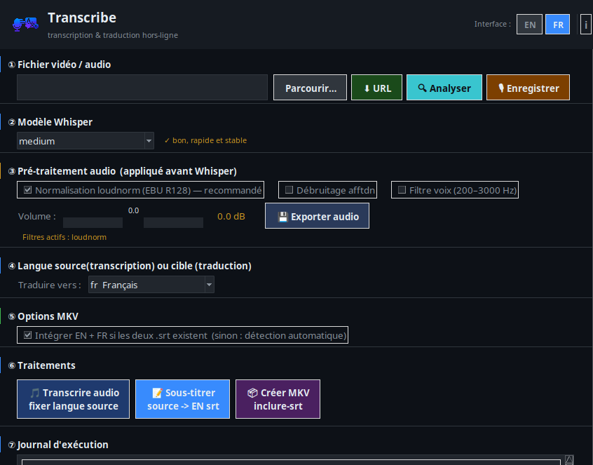
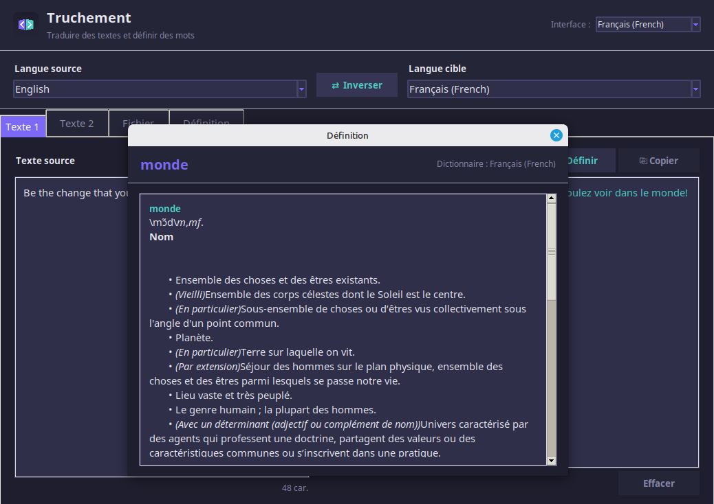

# Transcribe & Truchement


-lightgrey)


**Your language toolbox on a USB stick — no internet, no account, no data leaving your computer.**

Two portable desktop applications that work entirely offline:

- 🎙️ **Transcribe** — turn audio and video into text and subtitles
- 📖 **Truchement** — translate text and documents, and look up words in monolingual dictionaries

Both run from a regular folder or directly from a USB drive. Everything they need — the Python environment, the speech and translation models, the dictionaries — lives next to the executable. Plug the stick into another machine and everything still works, even without a network connection.

---

## Why offline?

- **Privacy** — your recordings, documents and searches never leave your machine. Nothing is uploaded, ever.
- **Availability** — works on a train, in the field, behind a strict firewall, or anywhere without connectivity.
- **No lock-in** — no account, no API key, no subscription. Free and open source (MIT).

## Screenshots

| Transcribe | Truchement |
|---|---|
|  |  |

---

## What can I do with it?

### 🎙️ Transcribe

- **Subtitle a video in minutes** — drop in a video, get a clean `.srt` file, and optionally embed English + translated subtitle tracks into a single `.mkv`.
- **Dictate a text file** — record yourself and get a `.txt` transcript.
- **Transcribe into another language** — Whisper can transcribe directly to English, or you can translate the subtitles afterwards.
- **Clean up difficult audio** — built-in loudness normalization, noise reduction and volume adjustment before transcription.
- **Grab online media for later** — download a video or audio source (via yt-dlp) while you *do* have a connection, process it offline afterwards.

Typical pipeline:

```text
[Video file]
     │
     ├─ 🔍 Analyze ──────────────── audio info + levels
     ├─ 🎚️ Preprocess ───────────── loudnorm / denoise / volume
     ▼
 📝 Transcribe (Whisper) ───────── movie.en.srt
     ▼
 🌐 Translate subtitles ────────── movie.fr.srt   (or any installed language)
     ▼
 📦 Mux with FFmpeg ────────────── movie.mkv  (both subtitle tracks embedded)
```

### 📖 Truchement

- **Translate text** between dozens of language pairs (English, French, Spanish, German, Portuguese, Italian, Russian, Japanese, Chinese, Arabic and more), powered by [Argos Translate](https://github.com/argosopentech/argos-translate) — the same open models used by LibreTranslate.
- **Translate whole documents** — `.txt`, `.srt`, `.docx`, `.pdf`, and `.html` (HTML keeps its structure, styles and scripts intact; only visible text is translated).
- **Look up definitions** in offline monolingual dictionaries (English, French, Spanish, German, Italian, Portuguese… and more available), with full-text search. Select a word in a translation and jump straight to its definition.
- **Interface in your language** — the UI adapts to your system locale and can be switched at any time.

---

## Quick start

### The easy way — with Baluchon

[**Baluchon**](https://github.com/fhoudebert/baluchon) is a small companion launcher that downloads the heavy parts for you (Whisper models, dictionaries, translation packages, the Python environment) and can create desktop shortcuts — handy when the apps live on a USB stick.

1. Download the latest release of Transcribe/Truchement from the [Releases page](https://codeberg.org/fhoudebert/transcribe/releases) and unzip it where you want it to live (folder or USB drive).
2. Run Baluchon in that folder and let it fetch the components listed in `downloads.csv`.
3. Launch `transcribe` or `truchement`. Done.

### The manual way

1. **Unzip a release** (or clone this repository) into its final location.

2. **Create the embedded Python environment** (this installs Argos Translate and the language packages into the app folder — it will not touch your system Python):

   ```bash
   cd build/python
   ./setup_venv_lang.sh
   ```

3. **Download one or more Whisper models** into `build/whisper/models/` — pick according to your machine:

   | Model | Size | Good for |
   |---|---|---|
   | [ggml-base.bin](https://huggingface.co/ggerganov/whisper.cpp/resolve/main/ggml-base.bin) | ~150 MB | quick drafts, modest hardware |
   | [ggml-medium.bin](https://huggingface.co/ggerganov/whisper.cpp/resolve/main/ggml-medium.bin) | ~1.5 GB | good accuracy / speed balance |
   | [ggml-large-v3-turbo-q8_0.bin](https://huggingface.co/ggerganov/whisper.cpp/resolve/main/ggml-large-v3-turbo-q8_0.bin) | ~0.9 GB | best quality on capable machines |

4. **Download the dictionaries you want** into `build/dic/` (one file per language, ~SQLite databases):

   [en-en](https://github.com/fhoudebert/transcribe/releases/download/dic/en-en.db) ·
   [fr-fr](https://github.com/fhoudebert/transcribe/releases/download/dic/fr-fr.db) ·
   [es-es](https://github.com/fhoudebert/transcribe/releases/download/dic/es-es.db) ·
   [de-de](https://github.com/fhoudebert/transcribe/releases/download/dic/de-de.db) ·
   [it-it](https://github.com/fhoudebert/transcribe/releases/download/dic/it-it.db) ·
   [pt-pt](https://github.com/fhoudebert/transcribe/releases/download/dic/pt-pt.db)

   More languages (ru, ro, da, el, ja, tr, sv, zh…) are listed in [`downloads.csv`](downloads.csv).

5. **Launch** the app:

   ```bash
   ./truchement     # translation & dictionaries
   ./transcribe     # transcription & subtitles
   ```

> **Windows:** support is in active development. The apps are designed to run from the same folder layout on both systems; a Windows build will be published in the releases.

---

## Running from a USB stick

This is a first-class use case, not an afterthought:

- Copy the **whole application folder** to the stick — models, dictionaries and the Python environment travel with it.
- Nothing is written to the host machine's user profile; language packages and settings stay inside the app folder (`build/argos-data/`, `build/dic/`…).
- On Linux, prefer copying with `cp -a` or `rsync -a`. On file systems that don't support symbolic links (exFAT, FAT32, NTFS), make sure the embedded environment was created in "copies" mode — the release archives are prepared this way.
- If something was lost in a copy, Truchement includes a built-in **diagnostic** that tells you exactly what is missing and how to fix it, instead of failing silently.

## How it stays self-contained

```text
transcribe/                    ← the whole app: copy this folder, and it works
├── transcribe, truchement     ← the executables
├── build/
│   ├── python/venv/           ← embedded Python env (never touches system Python)
│   ├── whisper/models/        ← speech-to-text models (*.bin)
│   ├── argos-data/packages/   ← installed translation packages
│   ├── dic/                   ← offline dictionaries (*.db)
│   ├── ffmpeg/                ← media toolbox
│   └── yt-dlp/                ← media downloader
├── i18n/                      ← interface translations
└── *.sh                       ← command-line shortcuts for power users
```

Dictionaries are plain SQLite databases — a table `entries {lemma, definition}` plus an `entries_fts` full-text index — so you can build your own or convert existing ones (e.g. with [PyGlossary](https://github.com/ilius/pyglossary)).

## Command-line shortcuts

Everything the GUIs do is also scriptable. A few examples:

| Script | What it does |
|---|---|
| `audio2srt.sh` | audio/video → subtitle file |
| `audio2en.sh` | audio in any language → English text |
| `traduire-srt.sh` | translate an existing `.srt` |
| `soustitre.sh` | full video → subtitled video pipeline |
| `creerMKV.sh` / `inclure-srt.sh` | embed subtitle tracks into an `.mkv` |
| `enregistrer.sh` | record from the microphone |
| `download_url.sh` | fetch online media for offline processing |

## Troubleshooting

- **"No languages installed" in Truchement** — the translation packages are missing from `build/argos-data/packages/`. Re-run `build/python/setup_venv_lang.sh` (or Baluchon), or use the in-app *Diagnose* button to see where the app is looking.
- **First translation is slow** — the first use of a language pair loads its model into memory (a few seconds). Subsequent translations are near-instant.
- **App works on one machine but not after copying to a stick** — the copy probably dropped symbolic links. Recopy with `cp -a` / `rsync -a`, or use the release archives, which are link-free.

## Roadmap

- ✅ Linux support
- 🚧 Windows build (single stick usable on both OSes)
- 🚧 In-app management of translation packages and dictionaries
- 💡 Automatic source-language detection
- 💡 More dictionaries

Suggestions and bug reports are welcome in the [issue tracker](https://codeberg.org/fhoudebert/transcribe/issues).

## Built on the shoulders of

- [whisper.cpp](https://github.com/ggml-org/whisper.cpp) — offline speech recognition
- [Argos Translate](https://github.com/argosopentech/argos-translate) — offline neural translation
- [FFmpeg](https://ffmpeg.org) — audio/video processing
- [yt-dlp](https://github.com/yt-dlp/yt-dlp) — media downloading
- [PyGlossary](https://github.com/ilius/pyglossary) — dictionary conversion

## License

MIT — see [LICENSE](LICENSE).

---

*« Truchement » is an old French word for an interpreter — someone who carries meaning between languages. That's exactly what this toolbox does, and it fits in your pocket.*
